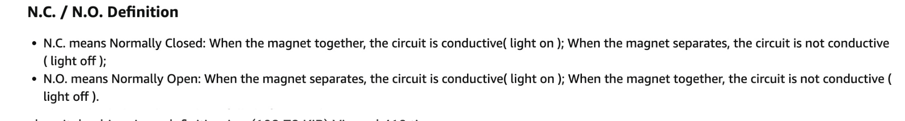
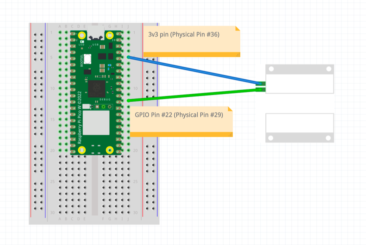

- [Table of Contents](#table-of-contents)
    - [The Idea](#the-idea)
    - [The Journey - TL;DR Version](#the-journey---tl;dr-version)
    - [The Journey - Long Version](#the-journey---long-version)
    - [The REST API for Text Messaging](#the-rest-api-for-text-messaging)
    - [Lessons Learned](#lessons-learned)
    - [Pictures](#pictures)
    - [Wiring Diagram](#wiring-diagram)
    - [Parts List](#parts-list)

## The Idea

Like many omg-will-this-ever-end projects, it started with a simple idea: why not install a sensor on my (snail)
mailbox to tell me when we get a delivery?

## The Journey - TL;DR Version

It was a big effort with lots of pitfalls. Wrote a lot more code than expected - in multiple languages on multiple
platforms. But, I finally have a reliable mailbox sensor.

## The Journey - Long Version

What follows is an account of my efforts to create what I thought would be fairly trivial. Spoiler alert: It wasn't.  
Anyway, I thought writing everything down would be cathartic for me and maybe instructive for others who are working
on similar projects.

1. ### Original Design <br>

What I had in mind initially was to use a single RPi 4 in my garage to be both my garage door sensor 
([another project](https://github.com/gamename/raspberry-pi-pico-w-garage-door-sensor)) and mailbox sensor. The plan was to run a 2-conductor cable from said garage RPi to my 
mailbox (about 50 feet). The need for a 2-conductor cable was because I expected to house a reed switch in the mailbox. 
I ordered the cable and it arrived a couple days later. I was careful to order outdoor-rated cable since it would be 
running down my driveway to the mailbox.

2. ### Of Cables, Staples, and Glue<br>

Two issues came up fairly quickly. One was how to secure the cables to my driveway, and the other was how to secure it
inside the garage. After some research, I found
these ["landscape staples"](https://www.amazon.com/gp/product/B0B3XFFKRD/ref=ppx_yo_dt_b_search_asin_title?ie=UTF8&th=1)
to bolt down the cable along the driveway perimeter. Issue #1 solved. Issue #2 was trickier. I was concerned about the
cable length potentially interfering with the reed switch's ability to function correctly. With that in mind, I wanted
to avoid doing things like routing cable up and over my garage door - which would add several feet. After invoking The
Google several times, I discovered [construction adhesive](https://www.amazon.com/gp/product/B015CJ94TQ/ref=ppx_yo_dt_b_search_asin_title?ie=UTF8&th=1)
which would let me glue the cable directly to concrete. This saved me cabling probably 20 to 25 extra feet (see pic
below).

3. ### Raspberry Pi 4<br>

At this point, I installed the RPi 4. I had done this many times before, so it was easy to get it up and running in
"headless" mode. Python also wasn't a problem; I've been programming in it for many years. I used GPIO pin #23 and
GPIO pin #1 to connect to the reed switch. The mailbox had the switch installed by this time too. Brimming with
confidence, I fired up a simple script:

```python
import RPi.GPIO as GPIO
import time

GPIO_CONTACT_PIN = 23  # Physical pin 16

GPIO.setwarnings(False)
GPIO.setmode(GPIO.BCM)
GPIO.setup(GPIO_CONTACT_PIN, GPIO.IN, pull_up_down=GPIO.PUD_DOWN)

while True:
    if GPIO.input(GPIO_CONTACT_PIN):
        print('Input was HIGH')
    else:
        print('Input was LOW')
    time.sleep(1)
```

...and nothing worked. The switch only worked intermittently. Sometimes the RPi sensed the switch, sometimes not. At
other times it gave the wrong answer based on switch state. After much research, I created
this [thread](https://forums.raspberrypi.com/viewtopic.php?t=356246) on the Raspberry Pi forum.

4. ### Fun with reed(ish) switches

By now it was obsessing about the cable length and how it could be the issue. It led to much googlation and discovering
the possibility I could damage the RPi because I did not have a resistor on the connection - or maybe a capacitor -
opinions varied. Much time was spent chasing this down. It appeared my design was workable, but not optimum.<br>

I retraced my steps, confirmed my wiring, and poured over lots of search results. I even revisited the vendor's reed
switch documentation. That turned out to be very instructive. Here is what I found in their product writeup:<br>
<br>
...which is exactly the [opposite](https://en.wikipedia.org/wiki/Reed_switch) of how Normally Open (NO)/Normally Closed (NC) switches operate.  In other 
words, they built it wrong.<br><br>
Here is how it is **supposed** to work:<br>
>_"The contacts are usually normally open, closing when a magnetic field is present, or they may be normally closed and
>open when a magnetic field is applied. "_<br>

So I moved my wiring to the "incorrect" connection on the switch, and it began to work - sorta. I did get the expected
behavior from the switch, but it was still intermittent. Sometimes when closing the mailbox door (and theoretically
closing the circuit) nothing would happen. The Python script did not sense any change. That convinced me to try using
a more powerful magnet to close the circuit (see pic below). I glued the new magnet to the mailbox door and saw clear
improvement.<br>
Now the script was behaving as expected most of the time and the magnets properly closed the circuit when the door was
closed. Opening the door was reported correctly too.<br>
But there was one remaining issue. There were still intermittent "open" and "close" states being reported
when nothing was being touched. Frustrating.
I'm sure that if I was a EE I could have figured out how to make this work. But I'm not a EE and Basic Electronics
training was 43 years ago in Air Force. It was time to shift gears on the project.

5. ### Enter Pico W<br>

Rather than continue to wrestle with cable length, resistors and/or capacitors, and potentially damaging my RPi, I
decided on another approach. Instead of a 50' switch connection, I would abandon the RPi 4 and use a microcontroller
(Pico W). That way I could colocate it and the reed switch on the mailbox itself. The cable length issues would go
away and the existing cable could be used to conduct the 5 volts needed by the Pico. The Pico W would use Wi-FI
to send its alerts and get updates (more on that later). A much simpler design.<br> 
I installed the Pico in a small box, then connected the power and reed switch to it. The Pico box was then placed
under the mailbox (see pics below). Everything was good to go in the hardware realm.

6. ### MicroPython<br>

Pico doesn't use Python, it uses MicroPython, which is Almost The Same. All I had to do was port my script. How
hard could that be?<br>
Turns out it wasn't hard - but there are caveats. In a sense, scripting on a microcontroller is monolithic. Things 
that are handled by the operating system on the RPi (or any other OS for that matter) have to be handled by your 
MicroPython script. You are, for example, responsible for setting up and maintaining the Wi-Fi connection. Therefore, 
the scripter has to be aware of various things not normally associated with Python (like setting the system time with 
NTP).


7. ### Wi-Fi Woes<br>
Coding the Wi-Fi function was simple enough, but the connections were unstable. Had to recode it a few times before
there was reasonably reliable connectivity. However, the connection would still inexplicably drop from time to time. It
was then I realized the Pico W quite far from my router. The signal strength was probably very weak out at the mailbox.
After installing a Wi-Fi extender, the intermittent drops went away. There were still other little quirks though. For
example, hostnames can only be a max of 15 characters. After finding that out, my host naming started working. At last,
we were good to go on the Wi-Fi side.

8. ### OTA? What OTA?<br>

Up to this point, the Pico was USB attached to my laptop most of the time. I would code changes, download them, and
do testing. When satisfied with the results, I would then physically carry the unit to my mailbox and install it.
This got tedious fast. All of this coding-testing-recoding effort highlighted the fact that some kind of remote
updating facility was needed.<br>
Research on the subject revealed that Over-The-Air (OTA) updates were possible, but not yet standardized on the Pico.
The best solutions I found were git-based. That is, when a user committed something to git, the OTA process would
detect the changes and pull a copy onto the Pico. I really liked that design. I found some interesting YouTube videos
on the subject (like [here](https://www.youtube.com/watch?v=f1widOJYQDc&t=162s) and 
[here](https://www.youtube.com/watch?v=UX87SrdqIoc)).<br>
They were good solutions. Clever and interesting. But they were not what I wanted. The sticking point for me
was that both expected to include an OTA module in all my repos. In other words, identical code would have to be 
copied to each Pico project. I didn't like that idea. It would turn into a maintenance problem. Any changes to the 
OTA code would mean copying it and committing it in multiple places. I foresaw headaches since I have several Pico 
projects.<br>
Long story short: I decided to write my own OTA module. Yes, it was a major digression. But it would avoid much pain
in the long run.

9. ### Fun with MicroPython Classes<br>

Leveraging Tim McAleer's [work](https://github.com/kevinmcaleer/ota), I created my
own [OTA project](https://github.com/gamename/micropython-over-the-air-utility).<br>
It was time-consuming, but fun. Design, coding and testing took a few days. I managed to circumvent the multiple copies
issue by adding support for multiple repos. <br>

10. ### Cognitive Complexity<br>

Meanwhile, by mailbox code was turning into spaghetti. The linter I used, SonarLint, started complaining about
"Cognitive Complexity" (i.e. maintainability) issues. I agreed. <br>
What started out as a simple effort had turned into a substantial collection of flags and recursive if-elsif-else
(il)logic. It was becoming less and less comprehensible. <br>
My solution was to write a mailbox class containing a finite state machine (FSM). The result is the
`MailBoxStateMachine` class in the `mailbox.py` file. It was another semi-digression, but well worth the time. I could
now offload much of the logic in the main script. The `main.py` script just had to instantiate a mailbox object along
with the OTA object. Much better.

11. ### Mem Leaks R Us<br>

Then things went nuts. I was getting crashes all over the place. All of them were related to memory. At
first, I thought the issue was the Pico simply didn't have enough memory to support the new mailbox/OTA objects. Great,
I thought, the effort to write those classes was wasted.<br>
But I stuck with it and continued debugging. Lots of logging and error-recovery code got written. I began logging all
the tracebacks to files. Forcing a restart of the Pico turned out to be a pretty good stopgap for the memory issues.
But that led to some crash-reload-crash loops. (At one point, I completely filled up the filesystem with traceback logs.
Recovering from that was an adventure.) That led to another stopgap where I would limit the number of system resets.
After crashing and reloading a set number of times, I would give up, send myself a text alert, and let the system stay
down.<br>
Eventually it became clear the problem was related to HTTPS GETs and POSTs. They seemed to cause a mem leak. After 6 or
so invocations of `requests.get()` or `requests.post()`, I would get some kind of memory exception. That gave me the
diagnostics I needed. I opened an [issue](https://github.com/micropython/micropython-lib/issues/741#issue-1920297025) in
`micropython-lib` and waited.

12. ### Back to Embedded C<br>

I didn't know how long it could be before someone would respond. My experience has not always been a good with open
source projects. I assumed the worst and began researching options.<br>
In spite of what I was seeing on MicroPython, I like the Pico. I wanted to stay with that platform. Maybe, I thought,
writing my app in C would be a more solid solution? There was, I knew, OTA support on FreeRTOS with Amazon Web Services
(AWS). Its been a while, but I've written in C and have lots of AWS experience. Why not give it a try?<br>
With some hesitation, I ventured down this new path. The setup for FreeRTOS was challenging, but I managed to get sample
apps (like `blink.c`) to work without much trouble. I coded a C app that was a close equivalent of the MicroPython
version and began testing.<br>
Debugging was where it got interesting. Debugging an embedded app on a Pico is non-trivial. You have to load libraries
and toolchains. Then you need to assemble (or buy)
the "[PicoProbe](https://datasheets.raspberrypi.com/pico/getting-started-with-pico.pdf?_gl=1*pxb6kq*_ga*MTM4NDkzMjQzNS4xNjc4MTM5NDg3*_ga_22FD70LWDS*MTY5NjM4NDAxNi40Ny4xLjE2OTYzODQ2MjguMC4wLjA.)"
hardware dongle.<br>
There were major issues getting this rig to work. I couldn't set breakpoints or make GDB "see" the Pico. It turned
out I had to make app changes to accommodate it. I was working my way through the extensive set of debugging
requirements when I heard back from the micropython-lib folks... <br>

13. ### Good News<br>

["jimmo"](https://github.com/jimmo) on GitHub informed me that I needed to make a simple change to my code and the
memory leaks should go away. Although the solution is not very 'pythonic' (Python should be doing its own garbage
collection), I was grateful he got back to me. Time to give this new fix a try.<br>
And it made a big difference. The memory problems disappeared. My MicroPython code is now working pretty well. So far,
the mailbox code has been running multiple days without incident. I **think** I finally have the solution I set out to
create. It was a long, fun road. Well, fun when it wasn't driving me nuts.

## The REST API for Text Messaging

In the code, there are requests like this one:

```python
resp = requests.post(self.request_url + state, headers=self.REQUEST_HEADER)
```

and this one:

```python
resp = requests.post(secrets.REST_CRASH_NOTIFY_URL, data=json.dumps(traceback_data), headers=REQUEST_HEADER)
```
They are what generate SMS text messages to someone's cell phone.

In my case, they are URLs for a REST definition on an API Gateway on AWS. The API Gateway passes the POST information
to an AWS Lambda function (see `aws-lambda/mailbox-sensor-lambda.py` in this repo for the source). The Lambda invokes
a call to a Simple Notification Service (SNS) topic. That topic is associated with a particular phone number. A message
from the Lambda function is sent to that phone number. Got it? :)

Yeah, its confusing. It is much simpler to set up than it sounds, but the learning curve is pretty steep to get to that
point. Don't give up though. There is a good substitution for it. Have a look at this website:<br><br>
https://pushover.net/
<br><br>For a small fee, you can send SMS text messages from there. They offer a REST API (with sample code). This is a
better option for most people.

## Lessons Learned

One important lesson I learned was never solder your Pico W directly to the circuit board. Instead, always use
a [breakout board](https://www.amazon.com/gp/product/B0BGHQXSRR/ref=ppx_yo_dt_b_search_asin_title?ie=UTF8&th=1) or
[socket pins](https://www.amazon.com/ZYAMY-2-54mm-Female-Straight-Connector/dp/B0778F2MLW/ref=sr_1_25?crid=1WDDUKJ6YIAV0&keywords=circuit+board+socket+pins&qid=1696878702&sprefix=circuit+board+socket+pins%2Caps%2C102&sr=8-25)
(I think that's what they're called) and plug the Pico into that.<br>
That way, you can easily swap in a new Pico if you have temporarily bricked the existing one. This has saved me
multiple times.

## Pictures

1. ### Corner of the garage were the cable joins the edge of the driveway<br>


2. ### Cable secured to the garage entrance edge with the construction adhesive<br>


3. ### Example of how the cable is secured to the driveway's edge using landscape staples<br>


4. ### Cable going up the support pole to the mailbox (it required 3 holes to be drilled)<br>


5. ### Box containing the Pico W


6. ### Underside of the Pico box. Note the magnets used to secure it under the mailbox.


7. ### Contents of the Pico box. Note the Pico is not soldered to a board, but seated in a breakout board. Makes swapping the Pico very easy.<br>


8. ### Reed switch inside the mailbox.<br>


9. ### Closeup of the stronger magnets used to close the switch<br>


10. ### The Pico box installed underneath mailbox.


## Wiring Diagram



## Parts List

1. [Pico W](https://www.amazon.com/dp/B0B72GV3K3?psc=1&ref=ppx_yo2ov_dt_b_product_details)
2. [Pico Breakout Board](https://www.amazon.com/dp/B0BGHQXSRR?ref=ppx_yo2ov_dt_b_product_details&th=1) (to avoid
   soldering Pico)
3. [2-Conductor Outdoor Cable](https://www.amazon.com/gp/product/B0C6J19DTX/ref=ppx_yo_dt_b_search_asin_title?ie=UTF8&th=1)
4. [Project Box](https://www.amazon.com/gp/product/B07Q14K8YT/ref=ppx_yo_dt_b_search_asin_title?ie=UTF8&th=1)
5. [Cable Tie Mounts](https://www.amazon.com/gp/product/B00DFZREGK/ref=ppx_yo_dt_b_search_asin_title?ie=UTF8&th=1) (for
   securing cable to mailbox support pole)
6. [Nylon Screws/Bolts](https://www.amazon.com/gp/product/B08DMSNB8X/ref=ppx_yo_dt_b_search_asin_title?ie=UTF8&psc=1) (
   to attach Pico to project box)
7. [Silicone Adhesive](https://www.amazon.com/gp/product/B00NGZHGFI/ref=ppx_yo_dt_b_search_asin_title?ie=UTF8&th=1) (to
   glue magnets to mailbox and Pico box)
8. [Construction Adhesive](https://www.amazon.com/gp/product/B015CJ94TQ/ref=ppx_yo_dt_b_search_asin_title?ie=UTF8&psc=1) (
   to glue cable to concrete)
9. [Landscape Staples](https://www.amazon.com/gp/product/B0B3XFFKRD/ref=ppx_yo_dt_b_search_asin_title?ie=UTF8&th=1) (to
   secure cable along perimeter of driveway)
10. [Power Supply](https://www.amazon.com/gp/product/B0827V2WT4/ref=ppx_yo_dt_b_search_asin_title?ie=UTF8&th=1)
11. [Wire Joiners](https://www.amazon.com/gp/product/B09NGH4S7K/ref=ppx_yo_dt_b_search_asin_title?ie=UTF8&th=1) (to join
    wires at the mailbox end and Micro-USB adapters)
12. [Wire Crimps](https://www.amazon.com/gp/product/B07RW6XVWZ/ref=ppx_yo_dt_b_search_asin_title?ie=UTF8&th=1) (for
    connecting to the reed switch)
13. [Wire Crimping Tool](https://www.amazon.com/gp/product/B07GFLWKTT/ref=ppx_yo_dt_b_search_asin_title?ie=UTF8&psc=1)
14. [Magnets](https://www.amazon.com/gp/product/B0BVY5VYQY/ref=ppx_yo_dt_b_search_asin_title?ie=UTF8&th=1)
15. or [Magnetic Tape](https://www.amazon.com/gp/product/B081CZ7V1V/ref=ppx_yo_dt_b_search_asin_title?ie=UTF8&psc=1) (to
    secure Pico box to mailbox)
16. [Reed Switch](https://www.amazon.com/gp/product/B07PRR33DF/ref=ppx_yo_dt_b_search_asin_title?ie=UTF8&th=1)
17. [USB to Micro-USB Power Cable](https://www.amazon.com/gp/product/B07TKHLZHT/ref=ppx_yo_dt_b_search_asin_title?ie=UTF8&th=1)
18. [Female Micro-USB Adapter](https://www.amazon.com/gp/product/B0B74LKPPT/ref=ppx_yo_dt_b_search_asin_title?ie=UTF8&th=1) (
    to connect to power cable)
19. Male Micro-USB Adapter - comes with female adapter above (to connect to Pico at mailbox end)
20. [Cable Clips](https://www.amazon.com/Monoprice-Circle-cable-clips-100pcs/dp/B0019R6SO0/ref=sr_1_4?crid=3OKVRBVSL48Y4&keywords=cable+clips&qid=1696610055&sprefix=cable+clips%2Caps%2C134&sr=8-4) (
    to secure cable to garage door frame)
21. [Magnetic Cable Zip Tie Base](https://www.amazon.com/gp/product/B0CF9PG68G/ref=ppx_yo_dt_b_search_asin_title?ie=UTF8&psc=1) (
    to secure wires underneath mailbox)
22. [Zip Ties](https://www.amazon.com/gp/product/B09P53D43R/ref=ppx_yo_dt_b_search_asin_title?ie=UTF8&th=1) (to bundle
    wiring at mailbox end)
23. [1/2" Drill Bit](https://www.amazon.com/gp/product/B004GIO0F8/ref=ppx_yo_dt_b_search_asin_title?ie=UTF8&th=1) (for
    hole in bottom of mailbox)
24. 3/16" Drill Bit - see above (for holes in the project box)
25. 3/32" Drill Bit - see above (for drilling into mailbox support pole)
26. Screws (to secure cable tie mounts to mailbox poll)
27. [Wire Stripper](https://www.amazon.com/gp/product/B0953113F7/ref=ppx_yo_dt_b_search_asin_title?ie=UTF8&psc=1)
28. [Wire Cutters](https://www.amazon.com/gp/product/B087P191LP/ref=ppx_yo_dt_b_search_asin_title?ie=UTF8&psc=1)
29. [Mini Screwdriver](https://www.amazon.com/gp/product/B07YJG766F/ref=ppx_yo_dt_b_search_asin_title?ie=UTF8&psc=1)
30. [LED Headlamp](https://www.amazon.com/Headlamp-Camping-LED-Headlight-Hunting/dp/B07QGRWZNB/ref=sxin_16_pa_sp_search_thematic_sspa?content-id=amzn1.sym.26abd864-41de-4663-b956-74ef0d53e0d2%3Aamzn1.sym.26abd864-41de-4663-b956-74ef0d53e0d2&crid=U71NGTTJK0J0&cv_ct_cx=led+head+light&keywords=led+head+light&pd_rd_i=B07QGRWZNB&pd_rd_r=03ac2192-fb6a-4b9a-a3eb-755f2077deac&pd_rd_w=ZztZI&pd_rd_wg=qv8U8&pf_rd_p=26abd864-41de-4663-b956-74ef0d53e0d2&pf_rd_r=EHPM6XE0PETN11X3SFPJ&qid=1696610316&s=hi&sbo=RZvfv%2F%2FHxDF%2BO5021pAnSA%3D%3D&sprefix=led+head+light%2Ctools%2C123&sr=1-4-2b34d040-5c83-4b7f-ba01-15975dfb8828-spons&sp_csd=d2lkZ2V0TmFtZT1zcF9zZWFyY2hfdGhlbWF0aWM&psc=1) ( comes in very handy)
31. [Wi-Fi Extender](https://www.amazon.com/gp/product/B07N1WW638/ref=ppx_yo_dt_b_search_asin_title?ie=UTF8&th=1)

